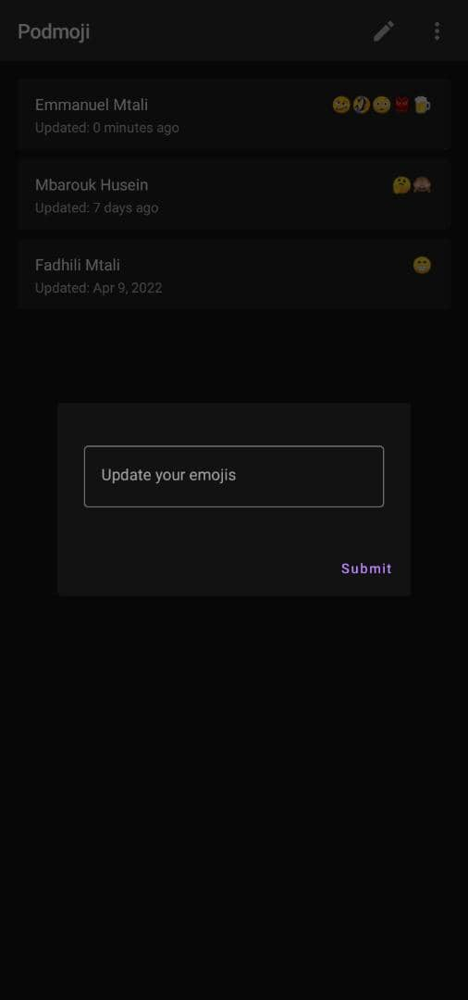

# Emojish 😗
Emojish is a simple app emoji sharing application developed with Kotlin, the application allow realtime emoji sharing


### Tech 🖥
- Kotlin
- Android
- Google firestore, cloud function and auth
- Jetpack Compose
- MVVM
- Logging with Timber
- e.t.c

### Setup
You require to setup firebase project to run this project on your own.


### Download

If you want to clone the repo, open a terminal and type a git checkout command:

    git@github.com:mtali/emojish.git

## Screenshots

<p align="center">



</p>

## Features

* Realtime emoji status update
* Google sign in
* Ability to edit emoji


## License

```
Copyright 2020 The Android Open Source Project

Licensed under the Apache License, Version 2.0 (the "License");
you may not use this file except in compliance with the License.
You may obtain a copy of the License at

    https://www.apache.org/licenses/LICENSE-2.0

Unless required by applicable law or agreed to in writing, software
distributed under the License is distributed on an "AS IS" BASIS,
WITHOUT WARRANTIES OR CONDITIONS OF ANY KIND, either express or implied.
See the License for the specific language governing permissions and
limitations under the License.
```


